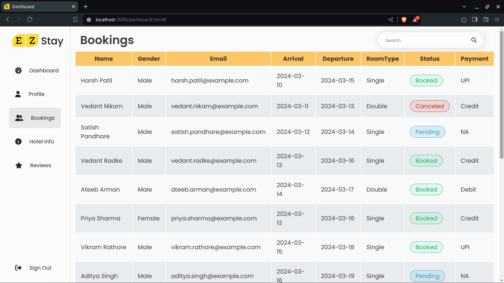

# EZStay
>Online Hotel Booking Platform
> Group 35

# 💻 Tech Stack:

      
<!-- Proudly created with GPRM ( https://gprm.itsvg.in ) -->

## Run Locally

1.Clone the repository using git
```
git clone https://github.com/harsh-m-patil/EZStay.git
```

2.Go to the EZStay directory
```
cd EZStay
```

3.Install Dependencies
```
npm install
# this packages will be installed cookie-parser express express-session mongodb mongoose nodemon
```

4.Run the server
```
npm start
```
the server will run on localhost:3000

## Screenshots
### Login Page


### Home Page


### Business Page


### Dashboards

__Hotel Admin__  



__Admin__  


__User__  
 

